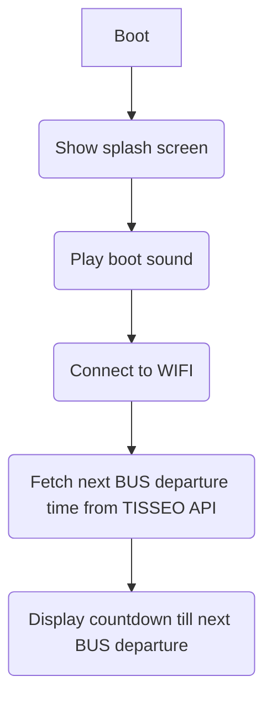

# TISSEO Bus Tracker 
## Objective
The aim is to communicate the next bus departure times (get through the TISSEO web API) on a TFT display screen. 
User can navigate in the menu thanks to a pushbutton rotary encoder.

## Materials
- ESP32
- TFT display screen
- Pushbutton rotary encoder

## How it works

### Initialization

### Main task
TODO
